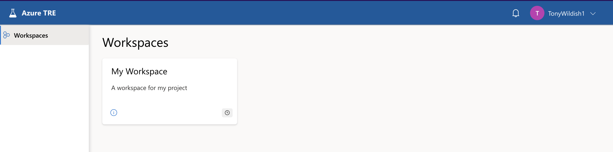

# Using your workspace

You access your workspace via the web, once you've been assigned an appropriate role. A workspace consists of several **workspace services**, plus also access to **shared services**, which are shared by all the workspaces in the SDE. The **Workspace Owner** can manage all the resources in their own workspaces, regardless of who created them, but cannot manipulate the shared services. A **Workspace Researcher** can also create and use certain resources, but can only delete or modify resources they have created themselves.

## Getting access to the SDE

As of December 2024, the MVP release of the SDE is now available, and will be the default mode of providing data and compute resources to projects approved through the DAC. If you have been given access to it, you can log in at https://sde.bartshealth.nhs.uk/, using your credentials. These credentials will either be:

* Your usual Barts Health credentials that you would use to log into your laptop or VDI. Generally your desktop login @ bartshealthnhs.uk (e.g.,  SmithJ@bartshealthnhs.uk)
* Dedicated credentials to access Precision Medicine related services (e.g., SmithJ@BHPrecisionMedicine.onmicrosoft.com). These will be provided if you do not have an NHS account that can be mapped into our Entra ID directory.

**TBD** [contact us](mailto:bartshealth.researchdatasupport@nhs.net) if you think you should be among them.

## Resource hierarchy: SDE, Workspace, User
Within the SDE, resources for a project are grouped into a Workspace, which has workspace-level resources. These workspace-level resources may also have user-level resources. The terms **project** and **workspace** both refer to the same thing as far as the SDE is concerned. From within a workspace, you will not have access to any other workspaces or their resources - this is a key feature of the SDE architecture. If you have multiple workspaces available to you, by way of being on multiple projects at the same time, the only way to share data between them will be to export it from one workspace and import it to the other.

**TBD** links
Some examples of workspace services:

* **Gitea** is a git repository management system. This should be installed once in each workspace to allow all Users in that workspace to use Git to share and manage your code within that workspace. Changes you make in these git repositories will need to be exported through the Airlock to be used elsewere.
* **Apache Guacamole** is a virtual desktop management system. This allows you to create virtual machines (Linux or Windows), and then get a virtual desktop to access them. Guacamole itself is a project-level resource, so you only need one per workspace, but the VMs created in it are specific to the user, so they are a user-level resource, not shared among multiple users.
* **MySQL** is a standard SQL database service, which, again, probably only needs one deployment per workspace. Each MySQL service can hold multiple databases, each with their own permissions.
* **Azure Databricks**, **AzureML**, and **MLflow** are available for machine-learning projects.

At the SDE level, the most important shared services are:

* **Gitea**. This shared service is useful for mirroring external Git repositories into the SDE network space so you can access them from within a workspace. Without this, you have no external access to, for example, GitHub. The access is one way, you cannot use this service to push changes back to GitHub. Access to this service can be provided by raising a [support issue](https://github.com/Barts-Life-Science/Support) and identifying the GitHub repositories that need to be mirrored.
* **Nexus**. This is a [package mirroring repository from Sonatype](https://help.sonatype.com/en/sonatype-nexus-repository.html), which allows you to download packages from [CRAN](https://cran.r-project.org/), [PyPi](https://pypi.org/), Ubuntu mirrors, and other sources. If you wish to access a package repository that is not currently mirrored then please raise a [support issue](https://github.com/Barts-Life-Science/Support).

**TBD** Document how to use these.
There are other services available, and new services can be created by building templates for them. If you have a need for a service that's not currently represented, [contact us](mailto:bartshealth.researchdatasupport@nhs.net).

## Accessing a workspace
When you log into the SDE, your initial view will look something like this. There will be a separate workspace for each project you have access to, in this example, there's only one project.

**TBD**

Click on the workspace to get the **Workspace Overview** page. There are other tabs there you can explore, to get more information about your workspace. They're not normally useful during operation, but if you file a bug report or an issue, a screenshot from the **Operations** tab is often helpful.

**TBD**

The workspace currently has no services in it. Workspace Owners can use the **Create new** button on the right to bring up a menu of resources to choose from, then you fill in the form with a few parameters, and submit the form. Your workspace resources will then appear here, as you can see in the next screenshot. Here, we see a **Gitea** service, which is still deploying, and a **Guacamole** service, which is ready for use.

**TBD**
N.B. We don't show the full process for deploying **Gitea** or **Guacamole**, since we will do that for you as part of the setup of your workspace. In any case, the process is very similar to that for creating a virtual machine, which is explained in detail below.

**TBD**

## Creating a Virtual Machine
Virtual machines are created via the **Guacamole** workspace service. From your workspace overview, click on the Guacamole service tile, which takes you to the screen below. Any existing VMs that you have access to will also be listed here, there are none at the moment.

Click the **Create new** button, then select an operating system, Windows or Linux.

 

The next form is practically identical for Windows or Linux machines, only the dropdown options vary. Fill in the obligatory name and description, select an **image** (which specifies which types of software the machine will have, what version of the operating system it runs etc), and a **size**, which specifies the number of CPUs and amount of memory.

You cannot, at this time, specify the size of the disk for the virtual machine. That may be added as a feature later on, [let us know](mailto:bartshealth.researchdatasupport@nhs.net) if you need that capability.

Similarly, the options for VM image and size are currently rather limited. We expect to add options in the future for VMs with GPUs etc, and we are aware of the need to customise images for different use-cases. Again, please [contact us](mailto:bartshealth.researchdatasupport@nhs.net) to let us know your requirements.

Leave the **Shared storage** button selected. This means your VM will have access to storage that exists at the workspace-level, so will persist if you delete your VM. If you only use the VM disk, you will lose everything on it when the VM is destroyed. There's more info on that in the [[Working with data]] page.

 

Click the **Submit** button, and after a few seconds, you see something like the next screenshot. You can either click the **Go to resource** button, or just click directly on the VM tile in the **Resources** section, to follow the progress of the deployment.

The deployment progresses through several stages:

* **pending** means the deployment is queued, but hasn't yet started
* **deploying** means the resource is being constructed
* **running** means the deployment succeeded

Other states exist, such as **failed**, or **updating**, we don't go into those here.

 

The **Operations** tab shows you detail of the deployment steps. The overall progress of the deployment is visible in the top-right in this view. Other buttons are greyed out at this point, and will remain so until the deployment finishes. This typically takes 5-10 minutes, but can take longer sometimes.

 

 

Now the VM is fully deployed, it's shown as **running** in the title, and the **Update**, **Delete** and **Actions** buttons are now active. In the **Actions** menu, there are three options:

* **Reset password** - ignore this, you don't need a password to access the VM.
* **Start** will start the VM if it has been stopped, and
* **Stop** will stop a running VM.

You will be charged for your VM all the time it is running. If you know you won't need it for a while (e.g. overnight, weekends, or holidays), it makes sense to **Stop** it when you don't need it, and **Start** it again to save your project budget. We envisage adding the ability to auto-shutdown machines which are idle for, say, an hour, but that isn't available yet.

 

Once the VM is fully booted, the Guacamole page will look like this. The VM is shown, with a **Connect** button, which will launch a new browser window connected to your VM.

 

Clicking the **Connect** button takes you to your virtual desktop. In this case, it's Ubuntu. You can hover over the icons for help on each.

 

Clicking the **Terminal** icon brings up a terminal window. When you're finished with your session, just close the browser tab. Reconnecting later will bring it back in the same state.

 

## Working with Linux VMs

* Your Linux VM has no direct connectivity to the internet. If you need to update a package, or install new software, you can access various mirrors courtesy of the Nexus shared service, but you won't be able to download software from arbitrary sites.
* VMs are not backed up. If you delete a VM, everything on the disk is destroyed, with no possibility of recovering it.
* On the other hand, stopping and restarting the VM from the **Action** menu does not wipe the contents of your home directory, so is a safe way of saving money when you don't need the VM for a while. *However*, the **/tmp** directory *is* wiped on reboots, so don't store anything there if you want to keep it.
* The home directory is mounted on the root filesystem, which is not large. If you fill the disk completely, your VM may stop responding, and you may lose access to it, possibly losing your work in the process. For this reason, it's better to work with the shared storage we will configure into your workspace.

## More details about workspaces
### Keeping VMs up to date
you should make sure you update the OS and software on your VMs regularly. Even though they're contained within a firewall, it's good best practice to make sure you're not running old software. For this reason, we'll be updating the VM templates regularly, and you can take advantage of that by simply deleting your VM and creating a new one.

This is the recommended best practice, and it requires that you think carefully about how you customise your machines. If you find that you need to put a lot of effort into customising an image, let us know, we may be able to do this for you, and automate the process.

## Considerations for workspace managers

## Cost efficiency
Workspace Admins are responsible for managing the cost of their workspaces. Once the MVP goes live, users will be expected to pay for their services, until then, the cost will be absorbed by the Precision Medicine team.

You can see the cost of your resources on the tile for that resource.  Generally, the most expensive resources are high-level managed functions like AzureML, or some of the larger VM sizes - particularly those with GPUs. Note that the cost displayed on the UI is from the Azure billing API, and may not directly reflect the cost you will be charged, the exact costing model has not yet been worked out. There is overhead for the SDE platform which has to be taken into account, not just the resources deployed into the workspace.

User resources (e.g. VMs), workspace resources, and workspaces themselves can all be 'disabled', to save costs. Services that are disabled are hibernated, to the extent possible for that service, to minimise expenditure. You will still be charged for any storage used by a service during hibernation, but not for compute etc. Storage is generally cheap, so its can be ignored for most purposes.

Note that disabling a service does _not_ disable services below them. E.g., disabling Guacamole, the virtual desktop service, does not cascade down to disabling the VMs that have been deployed by it, and disabling the workspace does not disable any of the services within it. If you want to disable everything, you have to start from the bottom up, disabling user resources, then workspace services, then the workspace itself.

We recommend that you monitor costs of your services in the first days of accessing your workspace, and decide which services to disable/re-enable based on your budget and convenience.

We will provide the means to automatically disable VMs after a certain amount of idle-time, though that's not yet available.